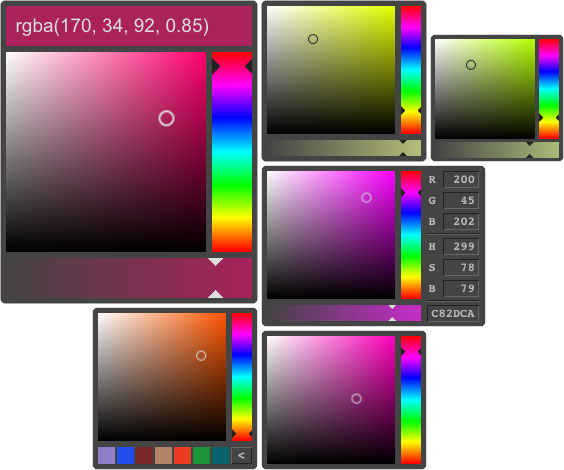

# tinyColorPicker and colors

Looking for mobile first, tiny foot print, fast, scaleable, flexible, pluggable and a rich color model...<br>
This small (5.07KB gZip, 11.39KB minified, no extra HTML, images or css needed) HSB colorpicker is based on a subset of [colors.js](https://github.com/PitPik/colorPicker/blob/master/colors.js) from it's big brother [colorPicker](https://github.com/PitPik/colorPicker/) for a precise and rich color model, supports all modern features like touch and MS pointer, GPU accelerated rendering, battery friendly requestAnimationFrame and provides a lot of hooks for developers to write plugins or extend the UI.

##Demo
See **demo** at [dematte.at/tinyColorPicker](http://dematte.at/tinyColorPicker)



Supports WCAG 2.0 calculations for readability based on opacity levels of multiple layers.<br>
Supported color spaces are: rgb, hsv(b), hsl, HEX.<br>
CMYK, CMY, Lab and XYZ and more standards are supported if using [colors.js](https://github.com/PitPik/colorPicker/blob/master/colors.js) from [github.com/PitPik/colorPicker](https://github.com/PitPik/colorPicker/)

## Usage

```javascript
<script type="text/javascript" src="jqColorPicker.min.js"></script>
<script type="text/javascript">
    $('.color').colorPicker(/* optinal options */); // that's it
</script>
```
```jqColorPicker.min.js``` holds all necessary data such as HTML, CSS and images in one file to run tinyColorPicker. So, it is not needed to include anything else than this single file.<br>
If you need to debug things for development, you can also use ```colors.js```, the color calculation module, and ```jqColorPicker.js```, the UI and interaction module seperately.
```javascript
<script type="text/javascript" src="colors.js"></script>
<script type="text/javascript" src="jqColorPicker.js"></script>
<script type="text/javascript">
    $('.color').colorPicker();
</script>
```

## AMD / CommonJS wrapper
tinyColorPicker now supports AMD and CommonJS import (thanks to [Munawwar](https://github.com/Munawwar)) in both, the minified version and the single fies (```colors.js``` and ```jqColorPicker.js```).

```javascript
// example for requirejs configuration
requirejs.config({
    baseUrl: 'scripts',
    paths: {
        jquery: 'lib/jquery-2.2.1.min'
    },
    shim: {
        'colorPicker': {
            deps: [ 'jquery' ],
            exports: 'jQuery.fn.colorPicker'
        }
    }
});

// then use tinyColorPicker in your module...
(function (root, factory) {
    if (typeof define === 'function' && define.amd) {
        define(['jquery', 'jqColorPicker'], function (jQuery) {
            return factory(root, jQuery);
        });
    } else {
        factory(root, root.jQuery);
    }
}(this, function(window, $){
    $('.color').colorPicker(options);
}));
```

## Bower support
tinyColorPicker can be received via bower:

```javascript
bower install tinyColorPicker
```

## jqColorPicker.js

```jqColorPicker.js``` is a jQuery plugin including the UI, CSS and images and uses an instance of Colors (from ```colors.js```) for all the color calculations. It passes the options to that instance, so some values might be the same when inspecting...

```javascript
$('.color').colorPicker({
    color: ..., // see Colors below...
    customBG: '#FFF' // see Colors below...
    animationSpeed: 150, // toggle animation speed
    GPU: true, // use transform: translate3d or regular rendereing (top, left)
    doRender: true | 'selector', // render color and bgColor of input field (on certain elements if selector)
    opacity: true, // enable / disable alpha slider
    buildCallback: function($elm) {
         // 'this': colorPicker instance; // will be the same as in positionCallback() and renderCallback();
         // $elm: the UI (<div class="cp-color-picker"></div>)
    },
    renderCallback: function($elm, toggled) {
        // 'this': current colorPicker instance; // instance has all kinds of information about colorPicker such as $UI including dimensions etc...
        // $elm: the input field or other element that just toggled the colorPicker;
        // toggle -> 'true': just appeared; 'false': just closed; 'undefined': is rendering
    },
    positionCallback: function($elm) {
        // 'this': current colorPicker instance;
        // $elm: the input field or other element that just toggled the colorPicker;
        // optionally...
        return {top: y, left: x}; // positions colorPicker before appearing
    },
    css: '', // String: replaces existing css
    cssAddon: '', // String: adds css to existing
    margin: '', // positioning margin (can also be set in cssAddon)
    scrollResize: true // toggle for repositioning colorPicker on window.resize/scroll
    gap: 4 // gap to right and bottom edge of view port if repositioned to fit
    dark: '#222' // default font color if background is light
    light: '#DDD' // default font color if background is dark
    preventFocus: false // prevents default on focus of input fields (e.g. no keyboard on mobile)
    body: document.body // the element where the events are attached to (touchstart, mousedown, pointerdown, focus, click, change),
    forceAlpha: // force printing alpha channel (undefined = auto; false = never print alpha)
});
```
See the following section or the demos on how the callbacks work and what you can do with them...

#### Some tips

The positionCallback can be used to optionally position the colorPicker different from its default; in case you want it to also show above or to the left of the input field etc.
The callback will also be called on scroll.
If you return an object (```{left: x, top: y}``` to position the colorPicker) then those coordinates will be taken, otherwhise the function just executes (what you need to do: re-append for example) and it takes the internal algorithm to position the color picker. See ./demo/index.js for an example:

```javascript
positionCallback: function($elm) {
    var $UI = this.$UI, // this is the instance; this.$UI is the colorPicker DOMElement
        position = $elm.offset(), // $elm is the current trigger that opened the UI
        gap = this.color.options.gap, // this.color.options stores all options
        top = 0,
        left = 0;

    // $UI.appendTo('#somwhereElse');
    // do here your calculations with top and left and then...
    return { // the object will be used as in $('.something').css({...});
        left: left,
        top: top
    }
}
```
This callback is also good if you need to append your colorPicker to a different container than document.body. This way you can then calculate the coordinates relative to the appended container...


The renderCallback can be used as openCallback and closeCallback:
```javascript
renderCallback: function($elm, toggled) {
    if (toggled === true) { // simple, lightweight check
        // ... like an open callback
    } else if (toggled === false) {
        // ... like a close callback
    } else {
        // rendering...
    }
}
```
Here you can fire events if necessary or check for a className or data attribute on $elm to see if there is a hint for hiding the opacity slider:
```javascript
this.$UI.find('.cp-alpha').toggle(!$elm.hasClass('no-alpha'));
```

## colors.js

This section only shows the options for color.js. They are picked up automatically if set in ```$('.color').colorPicker({/* options */});```

```javascript
Colors({ // all options have a default value...
    color: 'rgba(204, 82, 37, 0.8)', // initial color (#RGB, RGB, #RRGGBB, RRGGBB, rgb(r, g, b), ...)
    grey: {r: 0.298954, g: 0.586434, b: 0.114612}, // CIE-XYZ 1931
    luminance: {r: 0.2126, g: 0.7152, b: 0.0722}, // W3C 2.0
    valueRanges: {rgb: {r: [0, 255], g: [0, 255], b: [0, 255]}, hsv:...}, // skip ranges if no conversion required
    customBG: '#808080' // the solid bgColor behind the chosen bgColor (saved color)
    convertCallback: function(colors, type){}, // callback function after color convertion for further calculations...
});
```

## The color model, the methods and more

After initializing Color or ColorPicker you'll get a clean but rhich model of the instance:

```javascript
myColors: {
    colors: { all kinds of color values...  see later},
    options: { all the options you set or that are set as default... },
    __proto__: { // all methods Color uses (See https://github.com/PitPik/colorPicker for details)
        setColor: function(newCol, type, alpha) {},
        setCustomBackground: function(col) {},
        saveAsBackground: function() {},
        // new method: converts current color to HTML-String like: rgba(123, 234, 0, 0.89)
        // forceAlpha === true / false -> alway / never print alpha, === undefined -> auto
        toString: function('rgb' || 'hsl' || 'hex' || '' -> 'rgb', forceAlpha) {},
    }
}
```
colors.js is a quite handy tool for color calculations/conversion (gray value, contrast and luminance, etc...). It can also calculate layer mixes between background and foreground colors and therefore make calculations about readability (WCAG 2.0 standard).
If you need more complex calculations or more color spaces, use the version from https://github.com/PitPik/colorPicker. It supports also cmy, cmyk, XYZ and Lab.
```javascript
myColorPicker: {
    $trigger: ... // jQuery object of active trigger or null if none active
    $UI: ... // jQuery object of the colorPicker HTML element
    color: { // instance of Color inside colorPicker
        colors: { all kinds of color values... see later},
        options: { all the options you set or that are set as default... },
        __proto__: { all methods Color uses ... see above}
    },
    __proto__: { // all methods ColorPicker uses
        render: function() {},
        toggle: function(openClose) {} // openClose: true = open; false = close
    }
}
```


## The color model

```javascript
HEX: // current color as HEX (upper case, 6 digits)
rgb: // current RGB color as normalized values (0 - 1)
    r: // red
    g: // green
    b: // blue
hsv: // current color values in normalized HSV (HSB) model
    h: // hue
    s: // saturation
    v: // value (brightness)
hsl: // current color values in normalized HSL model
    h: // hue
    s: // saturation
    l: // lightness
RND: // all above colors in their defined ranges
    rgb: // current RGB color, rounded between 0 and 255
        r: // red (0 - 255)
        g: // green (0 - 255)
        b: // blue (0 - 255)
    hsv: // see above
        h: // hue (0 - 360 degrees)
        s: // saturation (0 - 100 %)
        v: // value (brightness) (0 - 100 %)
    hsl: // see above
        h: // hue (0 - 360 degrees)
        s: // saturation (0 - 100 %)
        l: // lightness (0 - 100 %)
background: // saved (background) color (saveAsBackground(){})
    rgb: // color in RGB model
        r: // red
        g: // green
        b: // blue
    RGB: // RGB color, rounded between 0 and 255
        r: // red (0 - 255)
        g: // green (0 - 255)
        b: // blue (0 - 255)
    alpha: // alpha or opacity value (0 - 1)
    equivalentGrey: // r = g = b = (0 - 255)
    rgbaMixBlack: // saved (background) color mixed with solid black color
        r: // red
        g: // green
        b: // blue
        a: // resulting alpha or opacity value (0 - 1)
        luminance: // luminance of resulting mix (0 - 1)
    rgbaMixCustom: // saved (background) color mixed with custom (solid) color
        r: // red
        g: // green
        b: // blue
        a: // resulting alpha or opacity value (0 - 1)
        luminance: // luminance of resulting mix (0 - 1)
    rgbaMixWhite: // saved (background) color mixed with solid white color
        r: // red
        g: // green
        b: // blue
        a: // resulting alpha or opacity value (0 - 1)
        luminance: // luminance of resulting mix (0 - 1)
alpha: // alpha or opacity value (0 - 1) of current color
equivalentGrey: // r = g = b = (0 - 1)
HUELuminance: // luminance of hue (in full brightnes and saturation) (0 - 1)
RGBLuminance: // luminance of the current color
hueRGB: // rounded integer value of current color in rgb model with full saturation and brightness
    r: // red (0 - 255)
    g: // green (0 - 255)
    b: // blue (0 - 255)
saveColor: // '' or 'web smart' or 'web save', if so.
webSave: // closest web-save color
    r: // red (0 - 255)
    g: // green (0 - 255)
    b: // blue (0 - 255)
webSmart: // closest web-smart color
    r: // red (0 - 255)
    g: // green (0 - 255)
    b: // blue (0 - 255)
rgbaMixBG: // color mix result: current color above saved (background) color
    r: // red (0 - 1)
    g: // green (0 - 1)
    b: // blue (0 - 1)
    a: // resulting alpha or opacity value (0 - 1)
    luminance: // luminance of resulting mix (0 - 1)
rgbaMixBGMixCustom: // color mix result: current color above saved (background) color above solid custom color
    r: // red (0 - 1)
    g: // green (0 - 1)
    b: // blue (0 - 1)
    a: // resulting alpha or opacity value (0 - 1)
    luminance: // luminance of resulting mix (0 - 1)
    luminanceDelta: // luminance difference between current color and resulting saved-custom mix (0 - 1)
    hueDelta: // hue difference between current color and resulting saved-custom mix (0 - 1)
    WCAG2Ratio: // readability vale (1 - 21, 1:1 to 21:1)
rgbaMixBlack: // color mix result: current color above solid black
    r: // red (0 - 1)
    g: // green (0 - 1)
    b: // blue (0 - 1)
    a: // resulting alpha or opacity value (0 - 1)
    luminance: // luminance of resulting mix (0 - 1)
    WCAG2Ratio: // readability vale (1 - 21, 1:1 to 21:1)
rgbaMixWhite: // color mix result: current color above solid white
    r: // red (0 - 1)
    g: // green (0 - 1)
    b: // blue (0 - 1)
    a: // resulting alpha or opacity value (0 - 1)
    luminance: // luminance of resulting mix (0 - 1)
    WCAG2Ratio: // readability vale (1 - 21, 1:1 to 21:1)
```
